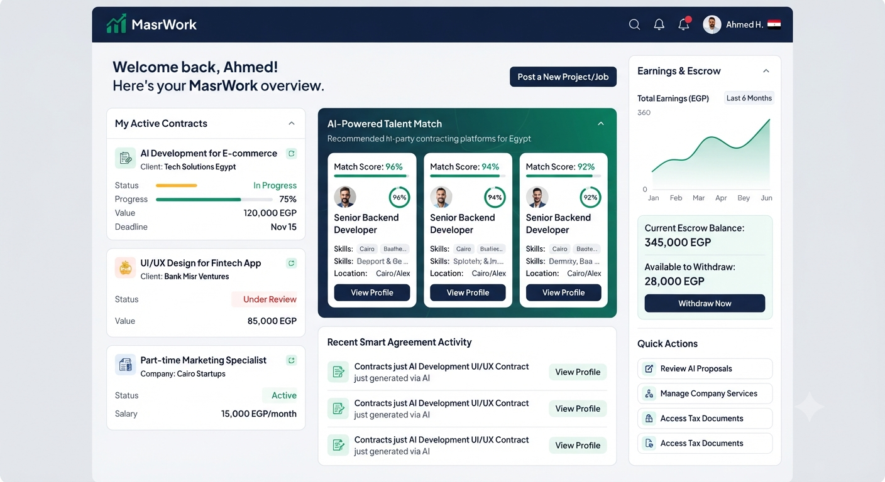

# 🚀 MasrWork
> An AI-powered tri-party ecosystem connecting companies, freelancers, and clients for full-time, part-time, and project-based contracting in Egypt, operating entirely in Egyptian Pounds (EGP).

---

## 🖼️ Platform UI Mockup

---

## 📌 1. Executive Summary
MasrWork addresses a major friction point in the Egyptian labor market: the need for a secure, flexible, and localized contracting environment. By eliminating foreign currency exchange complexities and replacing traditional bureaucracy with **Artificial Intelligence**, the platform offers a seamless ecosystem for companies to hire talent and sell B2B/B2C services safely.

---

## 🎯 2. The Tri-Party Ecosystem
The platform operates as an intelligent digital intermediary bridging three primary stakeholders:
1. **Freelancers:** Discover flexible career opportunities (Full-time / Part-time) or task-based gigs and get paid securely in EGP.
2. **Companies:** Hire top local talent or list their corporate services directly to individual and business buyers.
3. **Clients (Individuals & Businesses):** Purchase vetted services from registered companies and hire independent professionals with guaranteed deliverables.

---

## 🤖 3. AI-Driven Infrastructure
Instead of complex legacy systems or costly infrastructure, MasrWork leverages an advanced artificial intelligence engine for core operations:
* **AI-Powered Matching:** Deeply analyzes professional skill sets, portfolios, and job requirements to match companies with ideal candidates instantly.
* **Smart Agreement Generation:** Instantly drafts tailored, legally sound employment or service contracts based on agreed-upon terms, minimizing legal vulnerabilities under Egyptian labor frameworks.
* **AI Dispute Resolution:** Objectively analyzes platform communications, delivery logs, and milestone constraints to provide rapid, unbiased mediation reports for support teams.

---

## 💰 4. Monetization Strategy
* **Dynamic Commission:** A balanced percentage fee (8% to 12%) charged on completed transactions processed in EGP to ensure platform sustainability.
* **B2B SaaS Subscriptions:** Tiered monthly packages for companies to feature their corporate services and unlock advanced market insights.
* **AI Value-Added Services:** Advanced AI assistant tools for freelancers and companies (e.g., proposal optimization and productivity tracking) via token or subscription models.

---

## 🔒 5. Security & Escrow System
* **Local Centralized Escrow:** Integration with certified Egyptian payment gateways (e.g., Paymob, Fawry) to securely hold project funds in EGP.
* **Milestone Releases:** Funds remain locked in escrow until the deliverables are successfully verified and approved by the client, protecting all parties involved.

---

## 📈 6. Growth Roadmap
* **Phase 1 (MVP & Beta Launch):** Core platform development, AI engine integration, and launching with a curated cohort of Egyptian freelancers and startup companies.
* **Phase 2 (Scaling & Expansion):** Introducing new industrial sectors, scaling server capacities, and introducing advanced market data analytics for corporate subscribers.

---

## 📄 License & Copyright
© 2026 GreenTech Software Egypt. All rights reserved. 
This document, the UI previews, and the **MasrWork** project concepts are confidential and proprietary.
